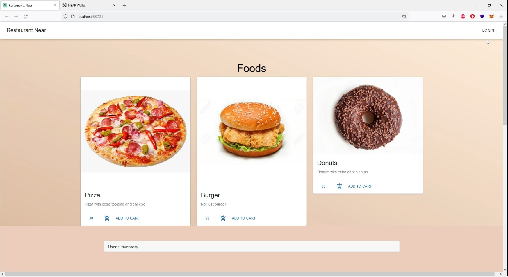

## What is Restaurant Near
In very simplistic language Restaurant Near make life of a vendor and consumer super simple by enabling  cryptocurrency payments from consumers to vendors from a single These autonomous and trust less payments are powered by Near protocol which makes it Super Fast , Super secure and super cheap(in Terms of transaction Fees)

Restaurant Near uses web3.0 methodologies assembly and react is an restaurant to buy and sell food using Near Protocol

Benefits of Restaurant Near for Vendors and Consumers

## VENDORS BENEFITS:

Acceptance of credit card payments generates vulnerability  for sellers for charge backs, which can be extremely hurtful as they incur losses. With crypto currence payments, they do not have to worry about chargebacks.

## CONSUMER BENEFITS:

While Paying a vendor with plastic or digital money such as credit-card, fiat payment gateways these means stores the user sensitive information which can be used to access funds even if the payment is not recurring. This makes users extremely vulnerable as in case of a data leak, their finances will be at risk. With Restaurant Near , only their public wallet address is stored, which cannot be used to access funds.

